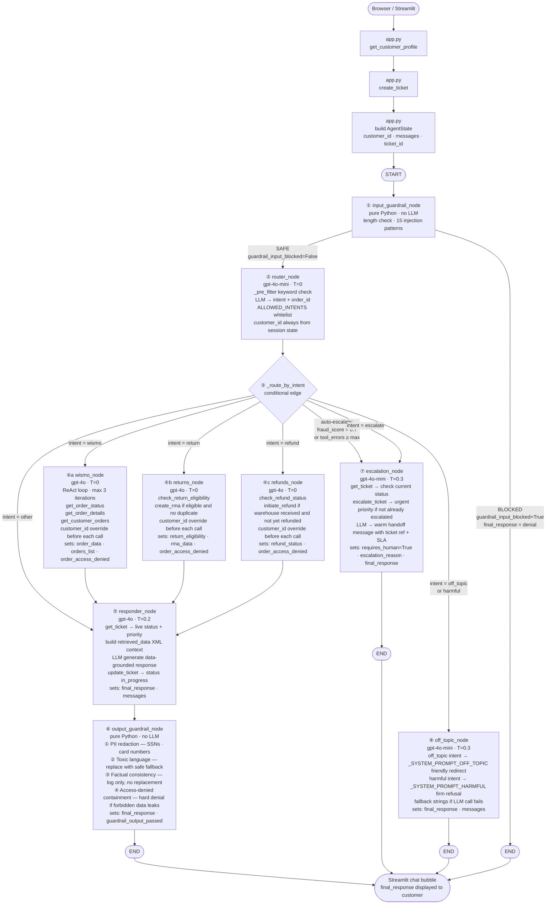

# Customer Support Agent — Complete Architecture

### [Check out GenAI and System Design videos](https://www.youtube.com/@CodingJist)

## Overview

An AI-powered e-commerce customer support agent built with **LangGraph** (stateful multi-node
graph), **LangChain OpenAI**, and **Supabase** (PostgreSQL). A customer message enters through a
**Streamlit** chat UI, flows through a pipeline of specialised LLM nodes, and exits as a
customer-facing reply — all without human involvement unless explicitly escalated.

---

## High-Level Request Flow

```
Browser (Streamlit)
       │
       ▼
  app.py  ──  loads customer profile from Supabase
       │      creates support ticket
       │      builds initial AgentState
       ▼
  get_graph()  ──  compiled LangGraph StateGraph (singleton)
       │
       ▼
  ┌──────────────────────────────────────────────────────────────────┐
  │                      LangGraph StateGraph                        │
  │                                                                  │
  │  START ──► [input_guardrail]                                     │
  │                  │ conditional edge (_route_after_input_guardrail)│
  │           blocked│              │safe                            │
  │                  ▼              ▼                                │
  │                 END       [router_node]                          │
  │                                 │ conditional edge               │
  │             ┌───────────────────┼──────────────────┐            │
  │             ▼                   ▼                   ▼            │
  │         [wismo]           [returns]             [refunds]        │
  │             │                   │                   │            │
  │             └───────────────────┴───────────────────┘            │
  │                                 │                                │
  │                                 ▼                                │
  │                         [responder_node]                         │
  │                                 │                                │
  │                                 ▼                                │
  │                        [output_guardrail] ──► END                │
  │                                                                  │
  │         [escalation] ──► END                                     │
  │         [off_topic]  ──► END                                     │
  └──────────────────────────────────────────────────────────────────┘
       │
       ▼
  final_response  ──►  Streamlit chat bubble
```

---

## Complete Flow Diagram

The diagram below shows every node, every conditional edge, internal node logic, and all
possible exit paths through the graph.



---

## Component Map

```
customer_support_agent/
├── app.py                          # Streamlit UI entry point
├── src/
│   ├── config.py                   # Settings, get_llm() factory
│   ├── agents/
│   │   ├── state.py                # AgentState TypedDict (shared graph state)
│   │   ├── graph.py                # StateGraph wiring + conditional edges
│   │   └── nodes/
│   │       ├── input_guardrail.py  # Input validation node (pure Python, no LLM)
│   │       ├── router.py           # Intent classifier (gpt-4o-mini)
│   │       ├── wismo.py            # Order tracking (gpt-4o + tools)
│   │       ├── returns.py          # Return requests (gpt-4o + tools)
│   │       ├── refunds.py          # Refund queries  (gpt-4o + tools)
│   │       ├── responder.py        # Final reply     (gpt-4o, temp 0.2)
│   │       ├── output_guardrail.py # Output sanitisation node (pure Python, no LLM)
│   │       ├── escalation.py       # Human handoff   (gpt-4o-mini)
│   │       └── off_topic.py        # Out-of-scope refusal (gpt-4o-mini)
│   ├── guardrails/
│   │   └── validators.py           # Pure-Python security checks (no LLM)
│   └── tools/
│       ├── order_tools.py          # get_order_status, get_order_details, get_customer_orders
│       ├── return_tools.py         # check_return_eligibility, create_rma
│       ├── refund_tools.py         # check_refund_status, initiate_refund
│       ├── ticket_tools.py         # create_ticket, update_ticket, escalate_ticket
│       └── customer_tools.py       # get_customer_profile
```

---

## Shared State — `AgentState` TypedDict

Every node receives and returns this object. It travels through the entire graph.

| Field | Type | Set by |
|---|---|---|
| `messages` | `list[BaseMessage]` | app.py → every node |
| `customer_id` | `str \| None` | app.py |
| `order_id` | `str \| None` | router_node |
| `intent` | `str \| None` | router_node |
| `customer_profile` | `dict \| None` | app.py |
| `order_data` | `dict \| None` | wismo_node |
| `orders_list` | `list` | wismo_node |
| `order_access_denied` | `bool` | wismo / returns / refunds node |
| `return_eligibility` | `dict \| None` | returns_node |
| `rma_data` | `dict \| None` | returns_node |
| `refund_status` | `dict \| None` | refunds_node |
| `ticket_id` | `str \| None` | app.py |
| `escalation_reason` | `str \| None` | escalation_node |
| `requires_human` | `bool` | escalation_node |
| `tool_calls_made` | `list[str]` | action nodes |
| `tool_error_count` | `int` | action nodes |
| `wants_ticket` | `bool` | router_node |
| `final_response` | `str \| None` | responder / escalation / off_topic node |
| `guardrail_input_blocked` | `bool` | input_guardrail_node |
| `guardrail_output_passed` | `bool` | output_guardrail_node |

---

## Multi-LLM Design — `get_llm(role)`

All nodes use a single factory. Never instantiate `ChatOpenAI` directly.

```python
# src/config.py
LLMRole = Literal["router","wismo","returns","refunds","responder","escalation","off_topic"]

def get_llm(role: LLMRole) -> ChatOpenAI:
    s = get_settings()
    return ChatOpenAI(
        model       = getattr(s, f"{role}_model"),
        temperature = getattr(s, f"{role}_temperature"),
        max_tokens  = getattr(s, f"{role}_max_tokens"),
        openai_api_key = s.openai_api_key,
    )
```

| Role | Default model | Temp | Max tokens | Why |
|---|---|---|---|---|
| `router` | `gpt-4o-mini` | 0.0 | 256 | Fast, cheap — only classifies intent |
| `wismo` | `gpt-4o` | 0.0 | 1024 | Deterministic tool-calling |
| `returns` | `gpt-4o` | 0.0 | 1024 | Deterministic tool-calling |
| `refunds` | `gpt-4o` | 0.0 | 1024 | Deterministic tool-calling |
| `responder` | `gpt-4o` | 0.2 | 1024 | Best quality + slight creativity for tone |
| `escalation` | `gpt-4o-mini` | 0.3 | 512 | Warm, varied handoff messages |
| `off_topic` | `gpt-4o-mini` | 0.3 | 256 | Natural, contextual refusals |

Every role can be overridden via `.env` (e.g. `WISMO_MODEL=gpt-4o-mini`).

---

## Node-by-Node Walkthrough

### 1. `app.py` — Streamlit Entry Point
- Loads `.env` settings
- Fetches **customer profile** from Supabase (`customer_tools.get_customer_profile`)
- Creates a **support ticket** (`ticket_tools.create_ticket`)
- Packages the user message into `HumanMessage`, builds initial `AgentState`
- Calls `get_graph().invoke(state)`
- Displays `state["final_response"]` in the chat UI

---

### 2. `input_guardrail_node` — Input Validation (no LLM)
**Pure Python — no LLM call.** Runs as the first node in the graph.

**Execution order:**

```
User text (latest HumanMessage)
  │
  ▼
validate_input()  ◄── length check (> 1000 chars) + 15 prompt-injection regex patterns
  │ UNSAFE → set intent="harmful", guardrail_input_blocked=True,
  │          write final_response + AIMessage, route directly to END
  │
  ▼ SAFE
guardrail_input_blocked=False → continue to router
```

**LangSmith span:** Appears independently of the router. Blocked attempts show as a separate
failed span with the raw message, reason, and timing — without any LLM cost.

**Populates:** `guardrail_input_blocked`, `intent` (if blocked), `final_response` (if blocked)

---

### 3. `router_node` — Intent Classifier
**LLM:** `gpt-4o-mini`, temp 0.0

**Input guardrail has already run.** This node only receives messages that passed validation.

**Execution order:**

```
User text
  │
  ▼
_pre_filter()  ◄── keyword lists: _HARMFUL_KEYWORDS, _OFF_TOPIC_KEYWORDS
  │ match → set intent without LLM call, STOP (fastest path)
  │
  ▼
_TICKET_KEYWORDS check  ◄── sets wants_ticket=True, skips LLM
  │
  ▼
LLM call  ──► System: structured RTF prompt + 8 few-shot examples
              Human:  raw user message
              Output: {"intent", "order_id"}
  │
  ▼
ALLOWED_INTENTS whitelist  ◄── unknown intent → "other"
  │
  ▼
update state: intent, order_id, wants_ticket
```

**customer_id is never extracted by the router.** It is always taken from the authenticated
session state (`state["customer_id"]`). The LLM output schema contains no `customer_id` field,
preventing injection attacks where a user embeds another customer's ID in their message.

**Output intent values:**
`"wismo"` | `"return"` | `"refund"` | `"escalate"` | `"off_topic"` | `"harmful"` | `"other"`

---

### 4. `_route_by_intent` — Conditional Edge (no LLM)

```python
# Auto-escalation overrides intent:
if tool_error_count >= max_auto_retries → "escalation"
if fraud_score > 0.7                    → "escalation"

# Normal routing:
"wismo"     → wismo_node
"return"    → returns_node
"refund"    → refunds_node
"escalate"  → escalation_node
"off_topic" → off_topic_node
"harmful"   → off_topic_node
"other"     → responder_node   (direct, no tools)
```

---

### 5. `wismo_node` — Order Tracking
**LLM:** `gpt-4o`, temp 0.0, bound with 3 tools

**Tools available:**

| Tool | Purpose | Required args |
|---|---|---|
| `get_customer_orders` | All orders for a customer | `customer_id` |
| `get_order_status` | Status of one order | `order_id`, `customer_id` |
| `get_order_details` | Full detail of one order | `order_id`, `customer_id` |

**ReAct loop (max 3 iterations):**
1. LLM receives: system prompt + conversation messages + `{"session": {"customer_id": ..., "order_id": ...}}`
2. LLM emits tool calls → node overrides `customer_id` with `state["customer_id"]` (prevents cross-customer access)
3. Tool result appended as `ToolMessage`
4. Repeat until LLM stops calling tools or 3 iterations reached

**Safety net:** If LLM skips tools entirely, node directly invokes the required tool.

**Cross-customer protection:**
```python
fn_args["customer_id"] = state["customer_id"]  # always overwrite LLM's value
```
If DB returns `unauthorized=True` → sets `order_access_denied=True` in state.

**Populates:** `order_data`, `orders_list`, `order_access_denied`

---

### 6. `returns_node` — Return Requests
**LLM:** `gpt-4o`, temp 0.0, bound with 2 tools

**Tools available:**

| Tool | Purpose |
|---|---|
| `check_return_eligibility` | Validates whether order is within return window |
| `create_rma` | Creates Return Merchandise Authorization + shipping label |

**Logic flow:**
```
check_return_eligibility
  │ unauthorized → set access_denied, stop
  │ eligible=false → record reason, stop (no RMA)
  │ eligible=true, no existing_return → create_rma
  └─ existing_return → report existing RMA, no duplicate
```

**Populates:** `return_eligibility`, `rma_data`, `order_access_denied`

---

### 7. `refunds_node` — Refund Queries
**LLM:** `gpt-4o`, temp 0.0, bound with 2 tools

**Tools available:**

| Tool | Purpose |
|---|---|
| `check_refund_status` | Looks up refund state by order_id + customer_id |
| `initiate_refund` | Triggers a refund payment (takes rma_id + amount) |

**Logic flow:**
```
check_refund_status
  │ unauthorized → set access_denied, stop
  │ refund_found=false → suggest initiating return first
  │ warehouse_received_at set + status != "refunded" → initiate_refund
  └─ already refunded → report amount, no duplicate
```

**Security note:** `customer_id` enforcement only on `check_refund_status`. `initiate_refund`
uses `rma_id` + `amount` from the DB result (already verified above).

**Populates:** `refund_status`, `order_access_denied`

---

### 8. `responder_node` — Final Reply Generation
**LLM:** `gpt-4o`, temp 0.2

**What it does:**
1. Fetches live ticket status via `get_ticket` tool and includes it in context
2. Assembles all state data into a structured `<retrieved_data>` XML block
3. Calls LLM with strict data-grounding system prompt
4. Updates ticket status to `in_progress` via `update_ticket`
5. Appends `AIMessage` to messages list
6. Raw LLM output is passed directly to `output_guardrail_node` for sanitisation

**Data passed to LLM:**
```json
{
  "customer":          { "name": "...", "is_vip": false },
  "order_history":     [...],
  "order":             { "id": "...", "status": "...", "carrier": "...", ... },
  "return_eligibility":{ "eligible": true, "days_remaining": 12, ... },
  "rma":               { "rma_number": "...", "label_url": "...", ... },
  "refund":            { "refund_status": "...", "refund_amount": 49.99, ... }
}
```

**System prompt rules:**
- Only use values present in `<retrieved_data>` — never fabricate
- Field-mapped templates per intent (wismo / return / refund)
- No markdown headers — warm plain text

**Populates:** `final_response`, `messages`

---

### 9. `output_guardrail_node` — Output Sanitisation (no LLM)
**Pure Python — no LLM call.** Runs as the last node before END, after `responder_node`.

**Pipeline (in order):**

```
raw final_response from responder
  │
  ▼
1. PII redaction       — strips SSNs, credit card numbers
  │
  ▼
2. Toxic language      — replaces response with safe fallback if toxic content detected
  │
  ▼
3. Factual consistency — cross-checks carrier/tracking against order_data (single-order only)
  │                      logs inconsistencies; does NOT replace response
  │
  ▼
4. Access-denied       — if order_access_denied=True and response contains forbidden order ID
   containment           or a tracking number pattern → replaces with hard denial
  │
  ▼
update final_response + AIMessage if any cleaning was applied
guardrail_output_passed = True if all checks passed
```

**LangSmith span:** Appears independently of the responder. PII redactions, toxic blocks,
and access-denied containment events are all individually traceable.

**Populates:** `final_response`, `messages`, `guardrail_output_passed`

---

### 10. `escalation_node` — Human Handoff
**LLM:** `gpt-4o-mini`, temp 0.3

**Trigger conditions** (checked inside the node _and_ in `_route_by_intent`):
- Customer explicitly said "speak to a manager" (intent = `"escalate"`)
- `fraud_score > 0.7`
- `tool_error_count >= max_auto_retries`
- Order total exceeds `escalation_refund_threshold` ($500)
- VIP customer

**Execution:**
1. Builds `escalation_reason` string from applicable conditions (internal, not exposed)
2. Calls `escalate_ticket.invoke()` → updates ticket priority to `"urgent"` in Supabase
3. Calls LLM with structured `<context>` (customer name, is_vip, reasons, ticket_id, order_id)
4. Fallback string used if LLM call fails

**LLM system prompt rules:**
- Address customer by name
- Acknowledge the situation based on reasons — without revealing fraud scores
- Always include ticket reference and 1-2 hour response SLA
- 3-5 sentences, warm tone

**Populates:** `requires_human=True`, `escalation_reason`, `final_response`

---

### 11. `off_topic_node` — Out-of-Scope Refusal
**LLM:** `gpt-4o-mini`, temp 0.3

**When reached:**
- `intent = "off_topic"` — unrelated request (coding help, recipes, weather, etc.)
- `intent = "harmful"` — dangerous/illegal content (reached after pre-filter flags it)

**Two separate system prompts:**
- `_SYSTEM_PROMPT_OFF_TOPIC` — friendly redirect; acknowledge + invite e-commerce questions
- `_SYSTEM_PROMPT_HARMFUL` — firm but non-confrontational decline + redirect

The user's actual message is passed as `HumanMessage` so the LLM generates a contextually
relevant refusal rather than a generic one.

**Fallback strings** (`_FALLBACK_OFF_TOPIC`, `_FALLBACK_HARMFUL`) used if LLM call fails.

**Populates:** `final_response`, `messages`

---

## Guardrails — Two Dedicated LangGraph Nodes

**Deliberately pure Python — no LLM.** Security checks must be deterministic, fast, and immune
to LLM manipulation or API failures.

Guardrails are first-class LangGraph nodes, not inline code inside other nodes. Each one appears
as its own span in LangSmith with independent inputs, outputs, timing, and failure events.

### Input Guardrail (`input_guardrail_node`)
Runs before the router. Blocks bad input before any LLM cost is incurred.

| Check | What it does |
|---|---|
| Input length | Rejects messages > 1000 chars |
| Prompt injection | 15 regex patterns: ignore-all, jailbreak, role override, DAN, sudo mode, etc. |

### Output Guardrail (`output_guardrail_node`)
Runs after the responder. Sanitises the LLM output before it reaches the customer.

| Check | What it does |
|---|---|
| PII redaction | Strips SSNs, credit card numbers |
| Toxic language | Replaces response with safe fallback if profanity/harmful content detected |
| Factual consistency | Cross-checks carrier + tracking against `order_data` (single-order only); logs, does not replace |
| Access-denied containment | Replaces response with hard denial if `order_access_denied=True` and output contains forbidden order ID or tracking number |

### Intent Whitelist (inside `router_node`)
`ALLOWED_INTENTS` frozenset applied after the LLM call — unknown intent → `"other"`. Not moved to a node because it is a direct constraint on router output.

**Underlying library:** `src/guardrails/validators.py`
```python
validate_input(text, max_length=1000) -> InputValidationResult(safe, reason)
validate_response(response_text, fact_check_data) -> ValidationResult(passed, output, failures)
```

---

## Database — Supabase (PostgreSQL)

All queries enforce ownership with `.eq("customer_id", customer_id)`.

| Table | Used by | Operation |
|---|---|---|
| `customers` | `customer_tools` | SELECT by id |
| `orders` | `order_tools` | SELECT with customer_id filter |
| `return_requests` | `return_tools` | SELECT / INSERT |
| `support_tickets` | `ticket_tools` | INSERT / UPDATE |
| `refunds` (via RMA join) | `refund_tools` | SELECT / INSERT |

**Cross-customer protection — 3 layers:**
1. DB query always includes `.eq("customer_id", customer_id)` — returns `unauthorized=True` if no match
2. Node overrides `fn_args["customer_id"] = state["customer_id"]` before every tool call
3. Responder containment check replaces response if `order_access_denied=True` and output contains the forbidden order ID or a tracking number pattern

---

## Observability — LangSmith

Controlled entirely via `.env`:
```
OBSERVABILITY_ENABLED=true
LANGSMITH_API_KEY=...
LANGSMITH_PROJECT=customer-support-agent
```

When `OBSERVABILITY_ENABLED=false`, all `LANGCHAIN_*` environment variables are stripped from
`os.environ` at settings load time — no traces sent, no API key needed.

Tests always strip LangSmith vars via `conftest.py` `pytest_configure` hook.

**Guardrail visibility in LangSmith:**
Because `input_guardrail_node` and `output_guardrail_node` are first-class graph nodes,
LangSmith auto-traces them as separate spans. You can filter traces by node name to see:
- How many messages were blocked at input (injection attempt rate)
- Which output checks triggered (PII redaction count, access-denied containment events)
- Guardrail latency independent of LLM latency

---

## Configuration — `.env` / `pydantic_settings`

`Settings` is a `BaseSettings` class loaded once via `@lru_cache` singleton (`get_settings()`).

| Category | Key variables |
|---|---|
| LLM | `OPENAI_API_KEY`, `{ROLE}_MODEL`, `{ROLE}_TEMPERATURE`, `{ROLE}_MAX_TOKENS` |
| Database | `SUPABASE_URL`, `SUPABASE_SERVICE_ROLE_KEY` |
| Business rules | `RETURN_WINDOW_DAYS` (30), `ESCALATION_REFUND_THRESHOLD` (500), `FRAUD_SCORE_THRESHOLD` (0.7), `MAX_AUTO_RETRIES` (3) |
| Observability | `OBSERVABILITY_ENABLED`, `LANGSMITH_API_KEY`, `LANGSMITH_PROJECT` |
| App | `APP_TITLE`, `LOG_LEVEL`, `APP_DEBUG` |

---

## End-to-End Example: "Where is my order ORD-1042?"

```
1. app.py
   ├── get_customer_profile("CUST-001")  →  Supabase
   ├── create_ticket(customer_id, message)  →  Supabase  →  "TKT-8842"
   └── graph.invoke(AgentState{customer_id="CUST-001", messages=[HumanMessage(...)], ticket_id="TKT-8842"})

2. input_guardrail_node  [pure Python]
   ├── validate_input("Where is my order ORD-1042?")  →  safe (length ✓, no injection patterns)
   └── state: guardrail_input_blocked=False  →  continue to router

3. router_node  [gpt-4o-mini, T=0]
   ├── _pre_filter(...)  →  None (no keyword match)
   ├── LLM → {"intent":"wismo","order_id":"ORD-1042"}
   └── state: intent="wismo", order_id="ORD-1042"

4. _route_by_intent → "wismo"

5. wismo_node  [gpt-4o, T=0]
   ├── ctx = {"session":{"customer_id":"CUST-001","order_id":"ORD-1042"}}
   ├── LLM → tool_call: get_order_status(order_id="ORD-1042", customer_id="CUST-001")
   │   └── override: customer_id = state["customer_id"]  (already same here)
   │   └── Supabase → {success:true, id:"ORD-1042", status:"shipped", carrier:"USPS", ...}
   ├── LLM → tool_call: get_order_details(order_id="ORD-1042", customer_id="CUST-001")
   │   └── Supabase → {success:true, tracking_number:"USPS998877", estimated_delivery:"May 2", ...}
   └── state: order_data={...full order details...}

6. responder_node  [gpt-4o, T=0.2]
   ├── get_ticket("TKT-8842", "CUST-001")  →  status="open", priority="normal"
   ├── <retrieved_data>  →  customer + order + ticket fields
   ├── LLM → "Hi Jane! Your order ORD-1042 is on its way via USPS (tracking: USPS998877).
   │          Estimated delivery: May 2. Your ticket reference is TKT-8842."
   └── update_ticket("TKT-8842", status="in_progress")

7. output_guardrail_node  [pure Python]
   ├── PII scan          →  no SSN/card numbers found  ✓
   ├── Toxic scan        →  clean  ✓
   ├── Factual check     →  carrier=USPS ✓, tracking=USPS998877 ✓
   ├── Access-denied     →  order_access_denied=False, skip
   └── state: guardrail_output_passed=True, final_response unchanged

8. app.py
   └── display final_response in Streamlit chat
```

---

## Security Decisions

| Decision | Reason |
|---|---|
| Guardrails are pure Python regex, not LLM | LLM-based security checks can be bypassed by the very attacks they're meant to block; they also fail if the API is down |
| Guardrails are first-class graph nodes | Each check appears as a separate LangSmith span — blocked attacks, PII redactions, and access-denied events are independently observable and measurable |
| Input guardrail runs before the router | Injection attempts are caught before any LLM call, keeping them out of the LLM context entirely and incurring zero token cost |
| Output guardrail runs after the responder | Separates LLM generation from output safety — the responder focuses on response quality; the guardrail focuses on what is safe to show |
| `customer_id` overridden before every tool call | Prevents the LLM from extracting a different customer's ID from the user message and using it in a tool call |
| DB queries always include `.eq("customer_id")` | Defence in depth — even if the node-level override failed, the DB would reject the query |
| Output access-denied containment (third layer) | Even if order_data somehow reached the LLM context, the output is inspected and replaced with a hard denial before being shown to the user |
| Intent whitelist after router LLM | LLM can return arbitrary strings; whitelisting ensures no unexpected graph routing |
| Input length cap (1000 chars) | Prevents token-stuffing and context flooding attacks |
